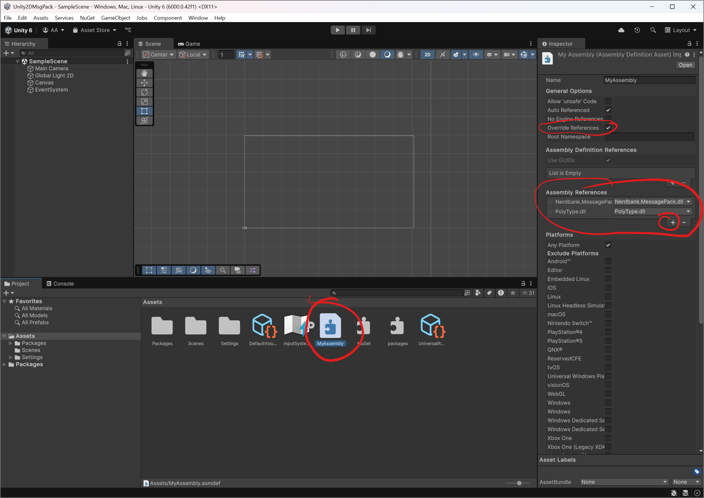

# Unity support

## Summary

Nerdbank.MessagePack is ready for [Unity](https://unity.com/), both for its mono and its IL2CPP backend.
The NativeAOT readiness of this library makes it an ideal library for IL2CPP in your game.

## Installation

1. Install [NuGetForUnity](https://github.com/GlitchEnzo/NuGetForUnity) into your project.
1. Use the new "NuGet -> Manage NuGet Packages" command in the Unity Editor to install the `Nerdbank.MessagePack` package. You may need to set the option to show prerelease versions.

## Known issues

### .NET Standard APIs only

Unity is currently limited to .NET Framework or .NET Standard 2.1 libraries.
Some of the preferred APIs in Nerdbank.MessagePack are exposed uniquely to .NET 8+ projects.
As a result, when reviewing documentation and samples for this library, be sure to look at the samples in their ".NET Standard" form.

### PolyType name collisions

If you encounter a compilation error such as the following:

> error CS0234: The type or namespace name 'ptSubject' does not exist in the namespace 'PolyType'"

Resolve it by taking the following steps:

1. Turn off "Auto Reference" for the conflicting assemblies.
   1. Within the Unity Editor, navigate to the Assets\Packages\PolyType.*\lib\libstandard2.x folder in your Project.
   1. Select the PolyType.dll file.
   1. Within the Inspector, uncheck the "Auto Reference" option. Click Apply.
   
   1. Repeat these steps to turn off Auto Reference from Assets\Packages\Nerdbank.MessagePack.*\lib\netstandard2.x as well.
1. Manually reference these two assemblies from your code.
   1. Within the Unity editor, create an Assembly Definition or select your existing one.
   1. In the Inspector, check the "Override References" option.
   1. Under Assembly References, click the Add button. Select the PolyType.dll assembly.
   1. Repeat the prior step, this time selecting to add a reference to the Nerdbank.MessagePack.dll.
   
   1. Scroll down as necessary in the Inspector and click Apply.
